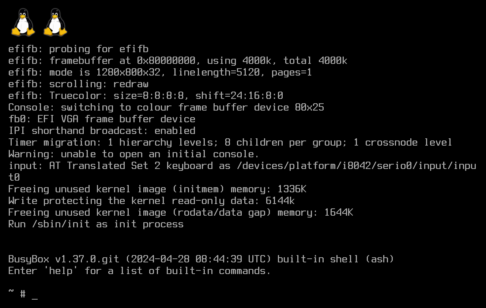

# Floppy Disk Linux



This repository provides a set of tools and configs to build a x86-64 Linux
distribution with the very latest software (kernel and userland), fitting
entirely on a 1.44 MB floppy disk and booting natively in a UEFI environment.

Heavily inspired by [Floppinux](https://github.com/w84death/floppinux), with the
further aim of supporting some key characteristics of modern PCs (64-bit architecture, UEFI
boot, SMP etc.) while also packing as much functionality as practically possible
in the form of [BusyBox](https://www.busybox.net/) command-line utilities.

Floppy Disk Linux is intended for education and experimental purposes only. Due
to the increasingly large size of the Linux kernel and related software, there
is of course not very much that can be squeezed into 1.44 MB[^1].

## Building

The provided makefile automatically downloads sources, applies configurations,
builds software and prepares the root filesystem as well as the final floppy
disk image.

Makefile host system requirements:

- `git` for fetching and updating all sources
- `fakeroot` for creating `rootfs.cpio`
- `sudo`, `mount`, `umount`, `mountpoint`, `losetup`, `mkfs.fat` for creating
  `floppy.img`
- `qemu-system-x86_64` and [OVMF](https://github.com/tianocore/tianocore.github.io/wiki/How-to-run-OVMF)
  for testing the images, if desired
- the usual core utilities found on GNU/Linux installations
- `make`, obviously

To fetch sources and perform initial configuration, run:

```sh
make configure
```

Afterwards, to start the actual build process:

```sh
make
```

The result is `floppy.img`: a FAT12-formatted disk image[^2] containing the
Floppy Disk Linux [EFI executable](https://www.kernel.org/doc/html/latest/admin-guide/efi-stub.html)
with the root filesystem embedded as an [initramfs](https://www.kernel.org/doc/html/latest/filesystems/ramfs-rootfs-initramfs.html#what-is-initramfs).

The image can then be written to an actual floppy disk:

```sh
sudo dd if=floppy.img of=/dev/fd0
```

(Substitute `fd0` accordingly if using a different or external floppy disk drive.)

To quickly test the OS in a [QEMU](https://www.qemu.org/) virtual machine:

```sh
make runqemu-bzImage
```

Or, to test the OS booting from the floppy disk image itself:

```sh
make runqemu-floppy.img
```

To clean up everything:

```sh
make reset
```

Refer to `Makefile` itself for other possible `make` targets.

## Booting

The `floppy.img` image should allow Floppy Disk Linux to boot from external
floppy disk drive connected to a modern PC via USB. Ensure that the PC's
firmware is configured to boot from such media.

The layout of `floppy.img` is as follows:

```txt
+--------------------------------------+-------------------------+
| Linux EFI stub (bootloader) & kernel | Root filesystem archive |
+--------------------------------------+-------------------------+
|          Linux EFI executable (\EFI\BOOT\BOOTX64.EFI)          |
+----------------------------------------------------------------+
|                        FAT12 filesystem                        |
+----------------------------------------------------------------+
|                            Raw disk                            |
+----------------------------------------------------------------+
```

According to [section 13.3.1](https://uefi.org/specs/UEFI/2.10/13_Protocols_Media_Access.html#system-partition)
of the UEFI Specification 2.10:

> For a diskette (floppy) drive, a partition is defined to be the entire media.

Therefore, creating a GUID Partition Table (GPT) and "EFI System Partition" on
`floppy.img` should not be necessary for it to boot successfully. To create a
GPT and place the filesystem on an EFI System Partition anyway, pass
`BOOTFS_CREATE_GPT=1` to `make`:

```sh
make BOOTFS_CREATE_GPT=1
```

`floppy.img` will then take the following form instead:

```txt
+--------------------------------------+-------------------------+
| Linux EFI stub (bootloader) & kernel | Root filesystem archive |
+--------------------------------------+-------------------------+
|          Linux EFI executable (\EFI\BOOT\BOOTX64.EFI)          |
+----------------------------------------------------------------+
|                        FAT12 filesystem                        |
+----------------------------------------------------------------+
|                      EFI System Partition                      |
+----------------------------------------------------------------+
|                       GPT-formatted disk                       |
+----------------------------------------------------------------+
```

## Limitations

- No support for [block devices](https://linux-kernel-labs.github.io/refs/heads/master/labs/block_device_drivers.html)
  and thus accessing persistent storage media (for example, internal SSDs or
  external USB mass storage devices, even the disk from which the OS is booted)
  is not possible from the OS. This means that the only filesystem to work with
  resides in memory and any changes made to / will be lost on system shutdown.

  This is because adding block device, USB and FAT filesystem functionality
  into the Linux kernel enlarges it by hundreds of kilobytes, beyond what would
  successfully fit on a 1.44 MB floppy disk.

  If you find a reasonable way to achieve mounting filesystems on persistent
  media, please [open an issue](https://github.com/Expertcoderz/floppy-disk-linux/issues/new/choose)
  describing how to do so and it may be incorporated into Floppy Disk Linux.

- No support for x2APIC, which may be necessary for SMP to work on real
  machines. Enabling x2APIC support in the Linux kernel requires also enabling
  PCI and IOMMU support.

- No fancy graphics, only a text console on the EFI framebuffer.

- No networking support of any kind.

- Non-goals of Floppy Disk Linux which will not be supported include booting on
  BIOS-based (non-UEFI) systems and running on an IA-32 (32-bit) processor.

## TODO

- Implement the ability to mount persistent storage devices.

- Implement support for x2APIC.

- Experiment on the use of a minimal external bootloader instead of the Linux
  EFI stub, to reclaim some disk space.

- Add `make` targets to analyze image size.

[^1]: For an example of a feature-rich OS on a floppy disk, see: https://menuetos.net/.

[^2]: Other FAT sizes such as FAT16 and FAT32 are unable to handle a 1.44 MB
filesystem size and thus cannot be used to format the floppy disk.
